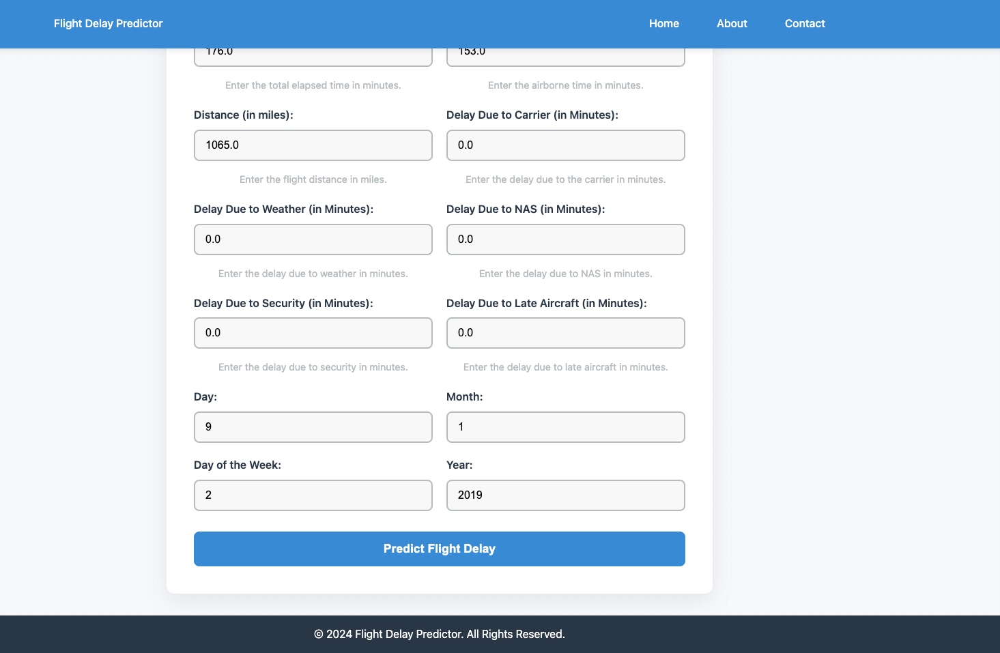

# Flight Delay Analysis

This project aims to analyze flight delays using various machine learning models. The goal is to predict whether a flight will experience a delay based on historical flight data. This project includes a dataset, data preprocessing, model training, and evaluation.

## Features
- **Data Collection**: Utilizes public flight datasets to gather historical flight data.
- **Data Preprocessing**: Includes data cleaning, handling missing values, feature engineering, and encoding categorical variables.
- **Model Training**: Trains machine learning models (e.g., XGBoost, RandomForest) to predict flight delays.
- **Evaluation**: Evaluates model performance using accuracy, precision, recall, and F1-score.

## Installation
1. Clone the repository:
   ```bash
   git clone https://github.com/your-username/Flight_delay_analysis.git
   cd Flight_delay_analysis
   ```

2. Create a virtual environment (optional but recommended):
    ```
    bash 
    python -m venv venv
    ```

3. Install the required dependencies:
    ```bash
    pip install -r requirements.txt
    ```

## Screenshots
Here are some visual representations of the project:

### Screenshot 1


### Screenshot 2


### Screenshot 3


## License
This project is licensed under the MIT License. See the LICENSE file for more details.


